# 📝 Meeting Transcript Summarizer Chatbot

An AI-powered chatbot that helps summarize **meeting transcripts** and provides clear insights on **what happened in a meeting**.  
This chatbot leverages **Google Drive**, **Pinecone**, **OpenAI**, and **Telegram**, orchestrated with **n8n**.

## 🚀 Features
- 📂 Fetches meeting transcripts (text/PDF/Docs) from **Google Drive**
- 🔍 Converts transcripts into embeddings using **OpenAI**
- 📊 Stores and searches embeddings efficiently with **Pinecone Vector DB**
- 🤖 Summarizes meeting highlights, decisions, and action items with **OpenAI Chat Model**
- 🔗 Automated workflows managed via **n8n**
- 💬 Provides summaries and answers via **Telegram Bot**

## 🛠️ Tech Stack
- **n8n** — Workflow automation
- **OpenAI** — Embeddings & summarization
- **Pinecone** — Vector DB for semantic search
- **Telegram Bot API** — Messaging interface
- **Google Drive API** — Meeting transcript storage

## ⚙️ Architecture Flow

### 🔹 Workflow Diagram (Mermaid)

```mermaid
flowchart TD
    A[📂 Google Drive API] -->|Fetch Meeting Transcripts| B[n8n Workflow]
    B -->|Convert to Embeddings| C[🔎 OpenAI Embeddings]
    C -->|Store & Search| D[📊 Pinecone Vector DB]
    D -->|Retrieve Transcript Context| E[🤖 OpenAI Chat Model]
    E -->|Summarized Insights| F[💬 Telegram Bot]
```


### 🔹 ASCII Flow
```
[Google Drive Transcripts] --> [n8n Workflow] --> [OpenAI Embeddings] --> [Pinecone Vector DB]
                                                                            |
                                                                            v
                                                             [OpenAI Chat Model] --> [Telegram Bot]
```

## 📦 Setup Instructions

### 1) Clone Repository
```bash
git clone https://github.com/anuradha2504/Meeting-Summary-chatbot-N8N/tree/main
cd meeting-summarizer-chatbot
```

### 2) Environment Variables
Create a `.env` file in the root:
```
OPENAI_API_KEY=your_openai_key
OPENAI_EMBEDDING_MODEL=text-embedding-3-small
PINECONE_API_KEY=your_pinecone_key
PINECONE_ENVIRONMENT=your_pinecone_env
PINECONE_INDEX=meeting-summarizer-chatbot
GOOGLE_DRIVE_API_KEY=your_gdrive_key
TELEGRAM_BOT_TOKEN=your_telegram_bot_token
```

### 3) Setup n8n
1. Install n8n (via Docker, desktop, or self-hosted).
2. Import the workflow JSON: `workflows/meeting_summarizer_chatbot.json`.
3. Configure credentials for **Google Drive**, **Pinecone**, **OpenAI**, and **Telegram**.

### 4) Deploy Pinecone Index
- Create index (e.g., `meeting-summarizer-chatbot`).
- Dimension = `1536` (for `text-embedding-3-small`).

### 5) Run the Bot
```bash
n8n start
```
Now users can send commands to the **Telegram bot** to get meeting summaries and answers.

## 📌 Example Usage
- **User (Telegram):** “who all attened the meeting ?.” 
- **Bot:** Extracts decisions from transcript → Returns concise list.

- **User (Telegram):** “What HR discussion happended ?” 
- **Bot:** Extracts decisions from transcript → Returns concise list.

- **User (Telegram):** “What did ravi said for budget?” 
- **Bot:** Extracts decisions from transcript → Returns concise list.

## 🧩 How It Works (Step-by-Step)
1. **Google Drive** stores transcripts (uploaded from Zoom, MS Teams, Google Meet, etc.).
2. **n8n** retrieves transcripts and processes text content.
3. **OpenAI Embeddings** convert text into semantic vectors.
4. **Pinecone** stores vectors and performs search on meeting context.
5. **OpenAI Chat Model** generates summaries, decisions, and tasks.
6. **Telegram Bot** delivers results instantly to users.

## 🛠️ Troubleshooting
- **No transcript found:** Ensure the transcript file is uploaded in Google Drive.
- **Bot silent:** Verify Telegram bot token inside n8n settings.
- **Index mismatch error:** Ensure Pinecone index dimension matches embedding model.
- **Incomplete summaries:** Re-check if transcript text was fully ingested.

## 🔮 Future Enhancements
- 📅 Integration with calendar apps for automatic meeting transcript ingestion
- 🎯 Speaker-based action item extraction
- 🌍 Support for multiple meeting languages
- 📊 Analytics dashboard for tracking recurring themes

## 👨‍💻 Author
Built by **Anuradha Kumari** using automation, AI, and workflow orchestration.
